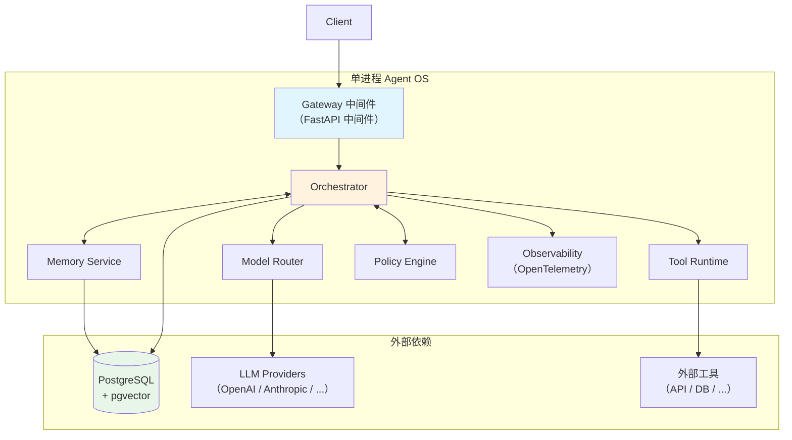
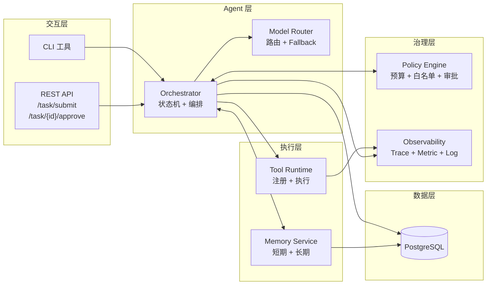
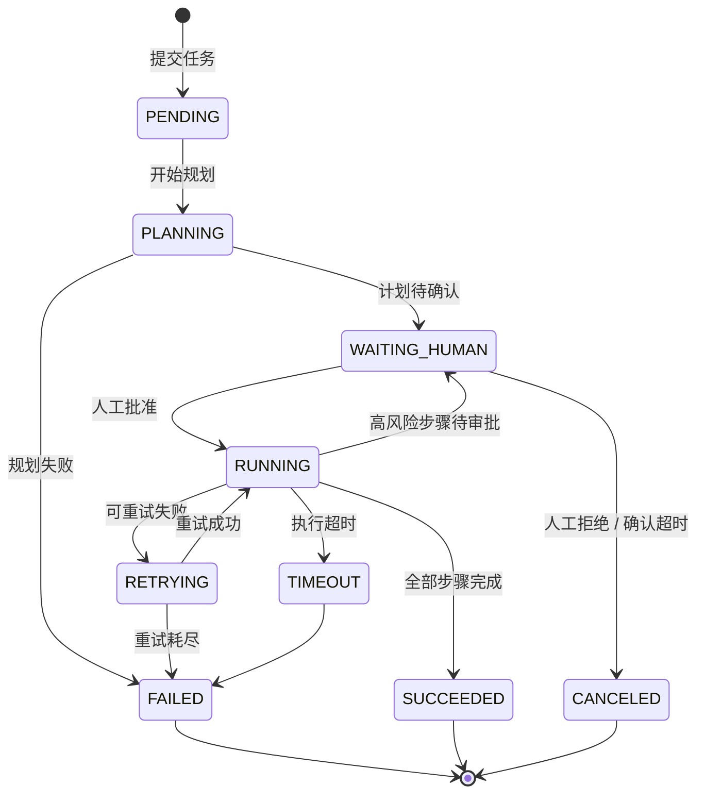
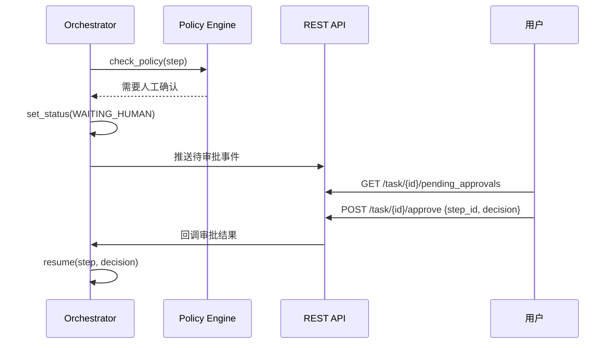
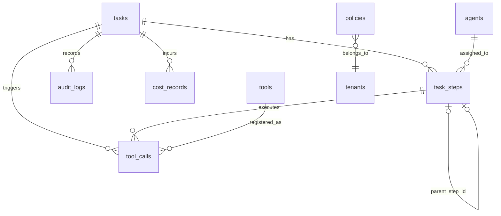
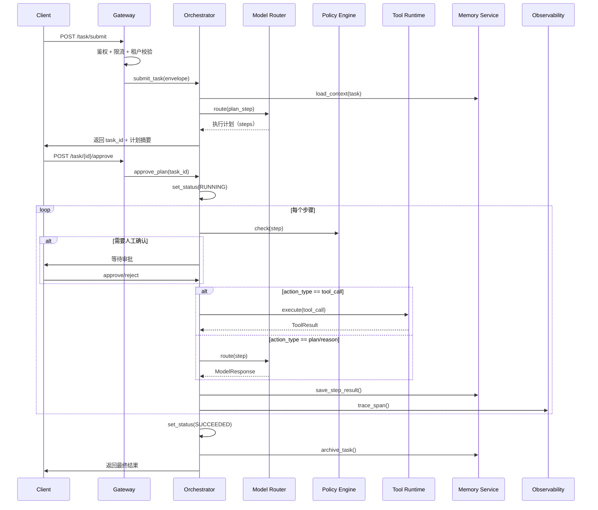
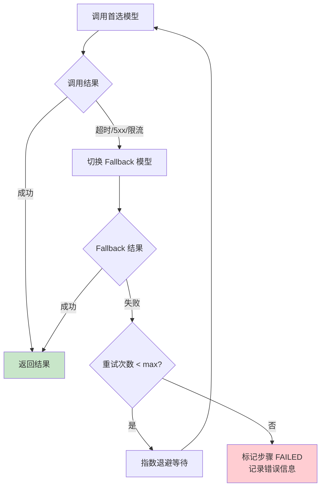
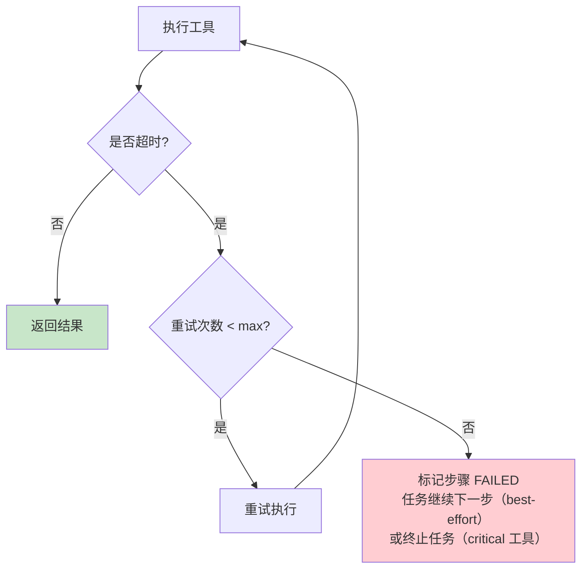

# Agent OS 技术实现指南（MVP 版）

本文档给出一个可落地的 Agent OS 技术方案，构建可运行、可观测、可治理的最小 Agent 系统。

## 1. 目标与边界

### 1.1 目标

- 支持单 Agent 到多 Agent 的任务执行
- 支持工具调用、状态持久化与失败重试
- 提供基础安全控制、日志追踪与成本监控

### 1.2 非目标

- 不追求一次性覆盖所有业务场景
- 不实现复杂自治策略（先人机协同）
- 不绑定单一模型厂商

---

## 2. 技术选型决策

| 领域 | 选型 | 理由 |
|------|------|------|
| 语言 | Python 3.11+ | AI 生态最成熟（OpenAI / Anthropic SDK、LangChain 均原生支持） |
| Web 框架 | FastAPI | 原生 async、类型安全、自动生成 OpenAPI 文档 |
| 关系数据库 | PostgreSQL 15+ | JSONB 支持半结构化数据、成熟稳定、行级安全策略支持租户隔离 |
| 向量存储 | pgvector 扩展 | MVP 阶段复用 PostgreSQL，避免引入独立向量库的运维成本 |
| 数据建模 | SQLAlchemy 2.0 + Pydantic v2 | ORM + 运行时校验，接口层 Pydantic 做序列化，持久层 SQLAlchemy 做映射 |
| 可观测性 | OpenTelemetry + structlog | 统一 Trace/Metric/Log 三大支柱，structlog 输出结构化 JSON |
| 任务调度 | APScheduler（进程内） | MVP 单进程内足够，后续可迁移至 Celery / Temporal |
| 容器化 | Docker + docker-compose | 本地开发与部署统一环境 |

### 备选对比

| 领域 | 备选 A | 备选 B | 决策理由 |
|------|--------|--------|---------|
| 向量存储 | Milvus | pgvector | MVP 数据量小，pgvector 免运维；数据量超百万条再迁移 Milvus |
| 任务调度 | Celery + Redis | APScheduler | MVP 单进程足够，Celery 引入 Redis 依赖增加运维复杂度 |
| 消息通信 | gRPC | 进程内函数调用 | 模块化单体阶段无需 RPC 开销，后续拆分时再引入 |
| 前端交互 | 自建 Dashboard | CLI + API Only | MVP 聚焦后端能力，前端延后 |

---

## 3. 部署方案

### 3.1 MVP 阶段：模块化单体

MVP 采用**模块化单体（Modular Monolith）**架构：所有模块运行在同一个 Python 进程中，模块间通过函数调用通信，避免分布式系统的网络开销和运维成本。



### 3.2 模块边界原则

- 每个模块是独立 Python Package，有明确的 `interface.py` 对外暴露方法
- 模块间禁止直接 import 内部实现，只通过接口调用
- 每个模块拥有独立的配置和测试
- 未来拆分为微服务时，只需将接口替换为 HTTP/gRPC 调用

### 3.3 后续演进路径

```text
MVP（模块化单体）→ 阶段二（抽取独立服务）→ 阶段三（多实例 + 消息队列）
```

| 阶段 | 触发条件 | 变更内容 |
|------|---------|---------|
| 拆分 Tool Runtime | 工具数量 > 10 或需要独立扩缩容 | 抽取为独立服务，通过 HTTP/gRPC 调用 |
| 拆分 Orchestrator | 并发任务 > 100 或需要横向扩展 | 引入消息队列，Orchestrator 多实例消费 |
| 拆分 Memory Service | 数据量超 pgvector 性能瓶颈 | 迁移至独立向量库（Milvus / Qdrant） |

---

## 4. 参考架构（模块级）



---

## 5. 核心模块设计

### 5.1 Gateway（入口层）

- **形态**：FastAPI 中间件 + 依赖注入，不独立部署
- **职责**：鉴权、限流、请求标准化、租户隔离
- **输入**：`task_request`
- **输出**：内部统一任务对象 `task_envelope`

请求接口：

```json
{
  "task_id": "uuid",
  "tenant_id": "t_001",
  "user_id": "u_001",
  "goal": "生成本周销售分析",
  "constraints": {
    "budget_usd": 2.0,
    "deadline_sec": 120
  },
  "context_refs": ["doc:weekly_sales", "sheet:q1_pipeline"]
}
```

### 5.2 Orchestrator（编排层）

**职责**：任务拆解、步骤调度、重试、超时控制

**任务拆解策略**：由 LLM 生成执行计划（Plan），经人工确认后按步骤执行。MVP 不支持运行中动态调整计划。

**状态机**：



**步骤调度机制**：

| 机制 | 说明 |
|------|------|
| 幂等执行 | 基于 `task_id + step_id` 去重，重试时跳过已完成步骤 |
| 重试策略 | 指数退避（1s, 2s, 4s），最大重试 3 次，仅对可重试错误生效 |
| 超时控制 | 每步骤独立 `timeout_sec`（默认 60s），总任务取 `deadline_sec` |
| 步骤间数据传递 | 上游 `step.output` 自动注入下游 `step.input.context` |

**步骤执行循环**：

```text
while steps_remaining:
    step = next_pending_step()
    if step.risk_level == "high":
        set_task_status(WAITING_HUMAN)
        await human_approval()        # 阻塞等待
    result = execute_step(step)
    if result.failed and result.retryable:
        schedule_retry(step)
    elif result.failed:
        set_task_status(FAILED)
        break
    persist(step, result)
```

### 5.3 Model Router（模型路由）

**职责**：按任务类型选择模型，控制成本与延迟

**路由规则**：

| 步骤类型 | 优先模型 | Fallback 模型 | 说明 |
|---------|---------|--------------|------|
| `plan`（规划） | 高推理模型（如 Claude Opus / GPT-4o） | 中等模型 | 需要强推理能力 |
| `reason`（推理） | 中等模型（如 Claude Sonnet / GPT-4o-mini） | 轻量模型 | 平衡成本与质量 |
| `extract`（抽取） | 轻量模型（如 Claude Haiku / GPT-4o-mini） | 无 | 结构化任务，成本优先 |

**任务类型判定**：由 Orchestrator 根据 `step.action_type` 决定，不依赖 LLM 自我判定。

**Fallback 策略**：
1. 首选模型调用失败（超时 / 5xx / 限流）→ 自动切换 Fallback 模型
2. Fallback 也失败 → 标记步骤失败，进入重试流程
3. 连续同一 Provider 失败 3 次 → 熔断 30s，期间全部走 Fallback

**成本控制粒度**：步骤级别。每步执行前检查 `task.cumulative_cost + estimated_step_cost <= task.budget_usd`。

### 5.4 Tool Runtime（工具运行时）

**职责**：统一工具注册、参数校验、权限检查、执行与结果回传

**工具生命周期**：


**工具注册规范**：

```json
{
  "name": "query_sales_db",
  "description": "查询销售数据库，支持 SQL 语句",
  "input_schema": {
    "type": "object",
    "properties": {
      "sql": {"type": "string", "description": "SQL 查询语句，仅支持 SELECT"}
    },
    "required": ["sql"]
  },
  "output_schema": {
    "type": "object",
    "properties": {
      "rows": {"type": "array"},
      "total": {"type": "integer"},
      "error": {"type": "string"}
    }
  },
  "permissions": ["data.read"],
  "risk_level": "medium",
  "approval_required": false,
  "timeout_sec": 30,
  "max_retries": 1
}
```

**MVP 内置工具**：

| 工具名 | 类型 | 权限 | 说明 |
|--------|------|------|------|
| `query_sales_db` | 只读 | `data.read` | SQL 查询（仅 SELECT） |
| `read_document` | 只读 | `doc.read` | 读取知识库文档 |
| `web_search` | 只读 | `web.read` | 网络搜索（预留，MVP 可不接入） |

**工具执行安全约束**：
- 所有写操作 `approval_required=true`，MVP 阶段不实现写工具
- 执行前对 input 做 JSON Schema 校验，不合规直接拒绝
- 每次调用记录审计日志（调用者、时间、工具、参数摘要、结果状态）

### 5.5 Memory Service（记忆服务）

**MVP 策略**：SQL 优先，暂不引入向量检索。

| 类型 | 存储 | 读写方式 | 生命周期 |
|------|------|---------|---------|
| 短期记忆（会话上下文） | PostgreSQL `conversation_context` 表 | 按 `task_id` 读写 | 任务结束后归档 |
| 长期记忆（用户偏好） | PostgreSQL `user_preferences` 表 | 按 `user_id` 读写 | 永久 |
| 知识片段 | PostgreSQL + pgvector `knowledge_chunks` 表 | 语义检索（预留接口） | 永久 |

**短期记忆管理**：
- 保留最近 10 轮对话
- 超出时对最早 3 轮做摘要压缩（由 LLM 执行，记录成本）
- 单任务上下文 token 上限：8000 tokens（约 12000 字符）

**长期记忆读写策略**：
- 写入：任务结束后，由 LLM 生成摘要（≤200 字）存入 `user_preferences`
- 读取：任务启动时，按 `user_id + tenant_id` 加载偏好，注入系统提示

**向量检索预留接口**：

```python
class MemoryService:
    def search_knowledge(self, query: str, top_k: int = 5) -> list[KnowledgeChunk]:
        """语义检索知识库。MVP 返回空列表，后续接入 pgvector。"""
        ...
```

### 5.6 Policy Engine（策略与治理）

**职责**：在执行前和执行中做策略判定

**策略存储**：PostgreSQL `policies` 表，支持运行时动态修改，不硬编码。

**核心策略**：

| 策略类型 | 检查时机 | 说明 |
|---------|---------|------|
| 预算上限 | 每步骤执行前 | `cumulative_cost + estimated_cost <= budget_usd` |
| 数据边界 | 工具调用前 | 校验租户 ID 一致性、字段脱敏规则 |
| 工具白名单 | 工具调用前 | 检查当前角色是否有该工具的调用权限 |
| 高风险审批 | 高风险步骤执行前 | 暂停执行，等待人工确认 |

**人工确认机制**：



- 确认超时：默认 30 分钟，超时后任务自动标记 `CANCELED`
- 超时提醒：超时前 5 分钟推送一次提醒

### 5.7 Observability（可观测）

**三大支柱**：

| 支柱 | 实现 | 关键字段 |
|------|------|---------|
| Log | structlog → JSON | `trace_id`, `task_id`, `step_id`, `tenant_id`, `level`, `message` |
| Trace | OpenTelemetry SDK | 每个 step 一个 Span，关联 model_call 和 tool_call 子 Span |
| Metric | OpenTelemetry Metrics | 任务成功率、步骤 P95 延迟、单任务成本、工具失败率 |

**日志规范示例**：

```json
{
  "trace_id": "abc123",
  "task_id": "t-001",
  "step_id": "s-003",
  "tenant_id": "tenant_a",
  "timestamp": "2026-04-11T10:30:00Z",
  "level": "info",
  "event": "tool_call_completed",
  "tool_name": "query_sales_db",
  "duration_ms": 230,
  "status": "success"
}
```

**MVP 监控看板指标**：

| 指标 | 计算方式 | 告警阈值 |
|------|---------|---------|
| 任务成功率 | `SUCCEEDED / TOTAL` | < 80% |
| 步骤 P95 延迟 | 步骤执行耗时分位 | > 30s |
| 单任务平均成本 | `SUM(cost) / COUNT(task)` | 超预算 50% |
| 工具失败率 | `FAILED / TOTAL` per tool | > 20% |

---

## 6. 模块间接口契约

### 6.1 接口总览

```text
Gateway → Orchestrator: submit_task(envelope) → Task
Orchestrator → Model Router: route(step) → ModelResponse
Orchestrator → Tool Runtime: execute(tool_call) → ToolResult
Orchestrator → Memory Service: load_context(task) → Context
Orchestrator → Policy Engine: check(step) → PolicyDecision
Orchestrator → Observability: trace_span(step, result) → void
Tool Runtime → Policy Engine: check_permission(tool, role) → bool
Memory Service → PostgreSQL: read/write
```

### 6.2 核心接口定义

**Orchestrator → Model Router**

```python
class ModelRouterInterface:
    def route(self, step: Step, context: Context) -> ModelResponse:
        """
        Args:
            step: 当前步骤（含 action_type, input）
            context: 会话上下文
        Returns:
            ModelResponse(output, model_name, tokens_used, cost_usd, latency_ms)
        Raises:
            ModelUnavailableError: 首选和 fallback 模型均不可用
            BudgetExceededError: 预估成本超限
        """
```

**Orchestrator → Tool Runtime**

```python
class ToolRuntimeInterface:
    def execute(self, call: ToolCall, context: Context) -> ToolResult:
        """
        Args:
            call: 工具调用（含 tool_name, args）
            context: 会话上下文（含 tenant_id, user_id, role）
        Returns:
            ToolResult(output, status, duration_ms)
        Raises:
            ToolNotFoundError: 工具未注册
            PermissionDeniedError: 权限不足
            ValidationError: 参数校验失败
            ToolTimeoutError: 执行超时
        """
```

**Orchestrator → Policy Engine**

```python
class PolicyEngineInterface:
    def check(self, step: Step, context: TaskContext) -> PolicyDecision:
        """
        Args:
            step: 待执行步骤
            context: 任务上下文（含累计成本、角色、租户）
        Returns:
            PolicyDecision(
                allowed: bool,
                reason: str,           # 拒绝原因
                requires_approval: bool, # 是否需要人工确认
                budget_remaining: float
            )
        """
```

**Orchestrator → Memory Service**

```python
class MemoryServiceInterface:
    def load_context(self, task: Task) -> Context:
        """加载任务上下文（短期记忆 + 用户偏好 + 关联知识）"""

    def save_step_result(self, task_id: str, step: Step, result: StepResult) -> None:
        """持久化步骤结果到短期记忆"""

    def archive_task(self, task: Task) -> None:
        """任务结束后归档短期记忆，生成长期记忆摘要"""
```

---

## 7. 数据模型

### 7.1 tasks（任务表）

| 字段 | 类型 | 说明 |
|------|------|------|
| `task_id` | UUID PK | 任务唯一标识 |
| `tenant_id` | VARCHAR(64) | 租户标识，行级安全隔离键 |
| `user_id` | VARCHAR(64) | 创建者 |
| `status` | ENUM | `PENDING/PLANNING/WAITING_HUMAN/RUNNING/RETRYING/TIMEOUT/SUCCEEDED/FAILED/CANCELED` |
| `goal` | TEXT | 任务目标描述 |
| `plan` | JSONB | 执行计划（步骤列表） |
| `constraints` | JSONB | 约束条件（budget_usd, deadline_sec） |
| `cumulative_cost_usd` | DECIMAL(10,4) | 累计花费 |
| `cumulative_tokens` | INTEGER | 累计 token 消耗 |
| `result_summary` | TEXT | 最终结果摘要 |
| `error_message` | TEXT | 失败原因（FAILED 时填写） |
| `max_retries` | INTEGER DEFAULT 3 | 最大重试次数 |
| `timeout_sec` | INTEGER DEFAULT 120 | 总任务超时 |
| `created_at` | TIMESTAMP | 创建时间 |
| `updated_at` | TIMESTAMP | 最后更新时间 |

### 7.2 task_steps（步骤表）

| 字段 | 类型 | 说明 |
|------|------|------|
| `step_id` | UUID PK | 步骤唯一标识 |
| `task_id` | UUID FK → tasks | 所属任务 |
| `step_order` | INTEGER | 步骤顺序 |
| `parent_step_id` | UUID FK → task_steps | 父步骤（支持嵌套） |
| `agent_role` | VARCHAR(64) | 执行 Agent 角色 |
| `action_type` | ENUM | `plan/reason/tool_call/human_gate` |
| `input` | JSONB | 步骤输入 |
| `output` | JSONB | 步骤输出 |
| `status` | ENUM | `PENDING/RUNNING/WAITING_APPROVAL/SUCCEEDED/FAILED/SKIPPED` |
| `model_name` | VARCHAR(128) | 使用的模型名 |
| `cost_tokens` | INTEGER | 本步骤 token 消耗 |
| `cost_usd` | DECIMAL(10,4) | 本步骤花费 |
| `retry_count` | INTEGER DEFAULT 0 | 已重试次数 |
| `error_message` | TEXT | 失败原因 |
| `started_at` | TIMESTAMP | 开始执行时间 |
| `ended_at` | TIMESTAMP | 执行完成时间 |
| `created_at` | TIMESTAMP | 创建时间 |

### 7.3 tool_calls（工具调用表）

| 字段 | 类型 | 说明 |
|------|------|------|
| `call_id` | UUID PK | 调用唯一标识 |
| `task_id` | UUID FK → tasks | 所属任务 |
| `step_id` | UUID FK → task_steps | 所属步骤 |
| `tool_name` | VARCHAR(128) | 工具名称 |
| `args_json` | JSONB | 调用参数 |
| `result_json` | JSONB | 返回结果 |
| `status` | ENUM | `PENDING/RUNNING/SUCCEEDED/FAILED/TIMEOUT` |
| `risk_level` | ENUM | `low/medium/high` |
| `approved_by` | VARCHAR(64) | 审批人（高风险操作） |
| `duration_ms` | INTEGER | 执行耗时 |
| `error_message` | TEXT | 错误信息 |
| `created_at` | TIMESTAMP | 调用时间 |

### 7.4 tools（工具注册表）

| 字段 | 类型 | 说明 |
|------|------|------|
| `tool_name` | VARCHAR(128) PK | 工具唯一名 |
| `description` | TEXT | 工具描述 |
| `input_schema` | JSONB | 输入 JSON Schema |
| `output_schema` | JSONB | 输出 JSON Schema |
| `permissions` | JSONB | 所需权限列表 |
| `risk_level` | ENUM | `low/medium/high` |
| `approval_required` | BOOLEAN DEFAULT false | 是否需要人工审批 |
| `timeout_sec` | INTEGER DEFAULT 30 | 执行超时 |
| `max_retries` | INTEGER DEFAULT 1 | 最大重试 |
| `enabled` | BOOLEAN DEFAULT true | 是否启用 |
| `created_at` | TIMESTAMP | 注册时间 |
| `updated_at` | TIMESTAMP | 最后更新时间 |

### 7.5 agents（Agent 注册表）

| 字段 | 类型 | 说明 |
|------|------|------|
| `agent_id` | VARCHAR(64) PK | Agent 唯一标识 |
| `name` | VARCHAR(128) | 显示名称 |
| `role` | VARCHAR(64) | 角色类型（planner/executor/reviewer） |
| `system_prompt` | TEXT | 系统提示词模板 |
| `allowed_tools` | JSONB | 可调用工具白名单 |
| `allowed_models` | JSONB | 可用模型白名单 |
| `permissions` | JSONB | 权限列表 |
| `enabled` | BOOLEAN DEFAULT true | 是否启用 |
| `created_at` | TIMESTAMP | 创建时间 |

### 7.6 policies（策略配置表）

| 字段 | 类型 | 说明 |
|------|------|------|
| `policy_id` | UUID PK | 策略唯一标识 |
| `tenant_id` | VARCHAR(64) | 租户标识 |
| `policy_type` | ENUM | `budget/data_boundary/tool_whelist/approval` |
| `name` | VARCHAR(128) | 策略名称 |
| `rule_json` | JSONB | 策略规则定义 |
| `priority` | INTEGER | 优先级（数值越大优先级越高） |
| `enabled` | BOOLEAN DEFAULT true | 是否启用 |
| `created_at` | TIMESTAMP | 创建时间 |
| `updated_at` | TIMESTAMP | 最后更新时间 |

### 7.7 audit_logs（审计日志表）

| 字段 | 类型 | 说明 |
|------|------|------|
| `log_id` | UUID PK | 日志唯一标识 |
| `trace_id` | VARCHAR(128) | 追踪 ID |
| `task_id` | UUID | 任务 ID |
| `step_id` | UUID | 步骤 ID |
| `tenant_id` | VARCHAR(64) | 租户 |
| `user_id` | VARCHAR(64) | 操作人 |
| `event_type` | VARCHAR(64) | 事件类型 |
| `resource_type` | VARCHAR(64) | 资源类型（tool/model/policy） |
| `resource_name` | VARCHAR(128) | 资源名称 |
| `action` | VARCHAR(64) | 操作（call/approve/reject/modify） |
| `detail` | JSONB | 详细信息（参数摘要，不含敏感值） |
| `status` | VARCHAR(32) | 操作结果 |
| `created_at` | TIMESTAMP | 事件时间 |

### 7.8 cost_records（成本记录表）

| 字段 | 类型 | 说明 |
|------|------|------|
| `record_id` | UUID PK | 记录唯一标识 |
| `task_id` | UUID FK → tasks | 任务 ID |
| `step_id` | UUID FK → task_steps | 步骤 ID |
| `model_name` | VARCHAR(128) | 使用的模型 |
| `provider` | VARCHAR(64) | 模型提供商 |
| `input_tokens` | INTEGER | 输入 token |
| `output_tokens` | INTEGER | 输出 token |
| `total_tokens` | INTEGER | 总 token |
| `cost_usd` | DECIMAL(10,4) | 花费（美元） |
| `latency_ms` | INTEGER | 延迟 |
| `created_at` | TIMESTAMP | 记录时间 |

### 表关系总览



---

## 8. 运行流程

### 8.1 正常流程（Happy Path）



### 8.2 异常流程

#### 模型调用失败



#### 工具执行超时



#### 人工确认超时

```text
步骤进入 WAITING_HUMAN
  → 启动 30 分钟倒计时
  → 剩余 5 分钟时推送提醒通知
  → 超时后：
    - 任务状态 → CANCELED
    - 记录审计日志（超时原因）
    - 通知用户任务已取消
```

#### 并发控制

| 场景 | 策略 |
|------|------|
| 同一租户多任务 | 按租户排队，最大并发数可配置（默认 5） |
| 同一任务多步骤 | 串行执行，MVP 不支持步骤并行 |
| 模型 API 限流 | 进程级令牌桶，按 Provider 维度限流 |

#### 长任务处理

- 任务超时（`deadline_sec`）后强制终止，标记 `TIMEOUT`
- 同步接口最大等待 30s，超时返回 `task_id`，客户端轮询 `GET /task/{id}/status`
- 异步通知预留接口，MVP 不实现

---

## 9. 安全与合规基线

- 最小权限：默认拒绝，按角色放行
- 敏感数据：传输 TLS 加密、存储字段级加密（AES-256）、日志自动脱敏（手机号/身份证/银行卡）
- 审计可追溯：保留任务级调用证据链，审计日志保留 90 天
- 租户隔离：PostgreSQL Row Level Security + 应用层 tenant_id 校验双保险
- SQL 注入防护：工具 `query_sales_db` 的 SQL 参数化执行 + 白名单关键字校验（仅允许 SELECT）

---

## 10. 回滚兜底方案

### 10.1 系统级回滚

| 场景 | 回滚策略 |
|------|---------|
| 新版本部署异常 | Docker 镜像版本化管理，回滚到上一版本镜像，数据库通过 Alembic 迁移脚本 downgrade |
| 数据库迁移失败 | Alembic 迁移在事务内执行，失败自动回滚；破坏性变更必须先备份 |
| 配置变更导致故障 | 策略配置支持版本历史，可一键回退到上一版本 |
| 外部依赖不可用 | Model Router Fallback 熔断机制；Tool Runtime 超时降级（标记失败，不阻塞系统） |

### 10.2 任务级回滚

| 场景 | 兜底策略 |
|------|---------|
| 任务执行中途失败 | 已完成步骤结果持久化，重试时跳过已完成步骤（幂等性保证） |
| 高风险操作误执行 | 所有写操作需人工审批 + 审计记录；MVP 不实现写工具，规避此风险 |
| 任务成本超支 | 步骤级预算检查，超支时终止任务并通知 |

### 10.3 数据安全兜底

| 场景 | 兜底策略 |
|------|---------|
| 数据误删 | PostgreSQL 每日全量备份 + WAL 增量备份，支持时间点恢复（PITR） |
| 租户数据泄露 | Row Level Security + 应用层双重校验；定期运行租户隔离验证脚本 |

---

## 11. 验收标准

### 接口契约

- [ ] REST API 符合 OpenAPI 3.0 规范，自动文档可访问
- [ ] 验证方式：启动服务后访问 `/docs`

### 功能完整性

- [ ] 单任务可从提交到返回结果走完全流程
- [ ] 至少 2 个只读工具可正常调用
- [ ] 高风险步骤触发人工确认，超时自动取消
- [ ] 验证方式：运行端到端测试用例集

### 性能指标

- [ ] 单步骤执行 P95 延迟 < 30s（不含模型推理时间）
- [ ] 系统级操作（非模型调用）P95 < 500ms
- [ ] 验证方式：OpenTelemetry 指标 + 压测脚本

### 安全合规

- [ ] 高风险写操作 100% 经过策略校验（MVP 无写操作，验收时通过单元测试覆盖）
- [ ] 租户数据隔离 100%（跨租户访问返回 403）
- [ ] 审计日志覆盖率 100%（所有工具调用和策略判定均记录）
- [ ] 验证方式：安全测试脚本 + 租户隔离验证脚本

### 可观测性

- [ ] 单任务全链路可追踪（trace 覆盖率 100%）
- [ ] 成本可统计到步骤级别
- [ ] 验证方式：Jaeger / Grafana Tempo 查看 Trace

### 成本控制

- [ ] 任务平均成本在预算范围内（`cumulative_cost <= budget_usd` 达成率 100%）
- [ ] 验证方式：cost_records 表聚合查询

---

## 12. 后续演进方向

- 多 Agent 协作图（Planner / Executor / Reviewer）
- 记忆质量评估与自动压缩
- 向量检索接入（pgvector → Milvus）
- 自动化故障归因（模型、工具、数据、策略）
- A/B 路由与策略实验平台
- 写操作工具与事务补偿机制

---

## 版本记录

| 版本 | 日期 | 变更 |
|------|------|------|
| v1.1 | 2026-04-11 | 补充技术选型、部署方案、接口契约、异常流程、回滚兜底；扩充数据模型；移除工期模块 |
| v1.0 | 2026-04-05 | 初版 |
